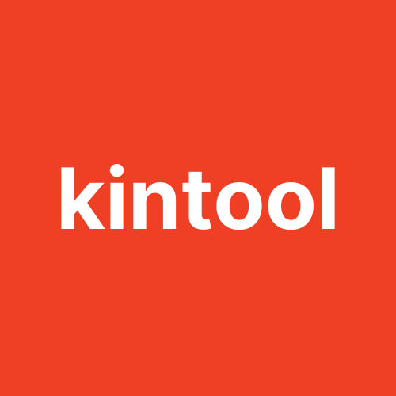

<a id="readme-top"></a>

<!-- PROJECT SHIELDS -->
<!--
*** I'm using markdown "reference style" links for readability.
*** Reference links are enclosed in brackets [ ] instead of parentheses ( ).
*** See the bottom of this document for the declaration of the reference variables
*** for contributors-url, forks-url, etc. This is an optional, concise syntax you may use.
*** https://www.markdownguide.org/basic-syntax/#reference-style-links
-->

[![Contributors][contributors-shield]][contributors-url]
[![Forks][forks-shield]][forks-url]
[![Stargazers][stars-shield]][stars-url]
[![Issues][issues-shield]][issues-url]
[![MIT][license-shield]][license-url]
[![LinkedIn][linkedin-shield]][linkedin-url]

<!-- PROJECT LOGO -->
<br />
<div align="center">
  <a href="https://github.com/fathulfahmy/kintool">
    
  </a>

<h3 align="center">Kintool</h3>

  <p align="center">
    A toolkit for Kintone JavaScript customization.
    <br />
    <a href="https://github.com/fathulfahmy/kintool"><strong>Explore the docs »</strong></a>
    <br />
    <br />
    <a href="https://github.com/fathulfahmy/kintool">View Demo</a>
    &middot;
    <a href="https://github.com/fathulfahmy/kintool/issues/new?labels=bug&template=bug-report.yml">Report Bug</a>
    &middot;
    <a href="https://github.com/fathulfahmy/kintool/issues/new?labels=enhancement&template=feature-request.yml">Request Feature</a>
  </p>
</div>

<!-- TABLE OF CONTENTS -->
<details>
  <summary>Table of Contents</summary>
  <ol>
    <li>
      <a href="#about-the-project">About The Project</a>
      <ul>
        <li><a href="#built-with">Built With</a></li>
      </ul>
    </li>
    <li>
      <a href="#getting-started">Getting Started</a>
      <ul>
        <li><a href="#prerequisites">Prerequisites</a></li>
        <li><a href="#installation">Installation</a></li>
      </ul>
    </li>
    <li><a href="#usage">Usage</a></li>
    <li><a href="#roadmap">Roadmap</a></li>
    <li><a href="#contributing">Contributing</a></li>
    <li><a href="#license">License</a></li>
    <li><a href="#contact">Contact</a></li>
    <li><a href="#acknowledgments">Acknowledgments</a></li>
  </ol>
</details>

<!-- ABOUT THE PROJECT -->

## About The Project

Kintool is a cross-platform development toolkit for Kintone. It provides a cross-platform JavaScript API, an integrated UI Component library, and a REST API Client.

<p align="right">(<a href="#readme-top">back to top</a>)</p>

### Built With

- [Kintone REST API Client][kintone-rest-api-client-docs]
- [Kintone UI Component][kintone-ui-component-docs]
- [Rollup][rollup-url]

<p align="right">(<a href="#readme-top">back to top</a>)</p>

<!-- GETTING STARTED -->

## Getting Started

```javascript
// Initialization
(async () => {
  await kintool.init();

  // REST API Client
  const getDropdownItems = async () => {
    const response = await kintool.api.record.getRecords({
      app: "1",
      query: 'Account_Status in ("Active")',
    });
    const items = response.records.map((rec) => rec.Name.value);
    return items;
  };

  // JavaScript API
  kintool.events.on("app.record.create.show", async (event) => {
    // UI Component
    const space = kintool.app.record.getSpaceElement("Name_Space");
    const dropdown = new kintool.ui.Dropdown({
      label: "Name",
      items: await getDropdownItems(),
    });

    space.appendChild(dropdown);

    return event;
  });
})();
```

### Prerequisites

- Kintone App

### Installation

#### Option 1: File Upload

1. Download the latest assets `kintool.zip` from [Releases][releases-url]
2. Go to [JavaScript and CSS Customization][kintone-customization-url] in Kintone App settings.
3. Upload `kintool.umd.min.js`.
4. Click on Save and Update App.

#### Option 2: CDN URL

1. Copy the CDN URL.
2. Go to [JavaScript and CSS Customization][kintone-customization-url] in Kintone App settings.
3. Paste the CDN URL.
4. Click on Save and Update App.

jsDelivr

```
// specific version
https://cdn.jsdelivr.net/npm/kintool@1.2.3/dist/kintool.umd.min.js

// version range
https://cdn.jsdelivr.net/npm/kintool@1.2/dist/kintool.umd.min.js
https://cdn.jsdelivr.net/npm/kintool@1/dist/kintool.umd.min.js

// latest
// NOT RECOMMENDED FOR PRODUCTION
https://cdn.jsdelivr.net/npm/kintool/dist/kintool.umd.min.js
```

UNPKG

```
// specific version
https://unpkg.com/kintool@1.2.3/dist/kintool.umd.min.js

// version range
https://unpkg.com/kintool@1.2/dist/kintool.umd.min.js
https://unpkg.com/kintool@1/dist/kintool.umd.min.js

// latest
// NOT RECOMMENDED FOR PRODUCTION
https://unpkg.com/dist/kintool.umd.min.js
```

<p align="right">(<a href="#readme-top">back to top</a>)</p>

<!-- USAGE EXAMPLES -->

## Usage

### JavaScript API

```javascript
(async () => {
  await kintool.init();

  // Access kintone with kintool
  kintool.events.on("app.record.create.show", (event) => {
    console.log(kintool.app);
    console.log(kintool.space);
    console.log(kintool.portal);
    console.log(kintool.isMobileApp);
    console.log(kintool.events.on);
    console.log(kintool.events.off);

    return event;
  });
})();
```

| API                                  | Description                                             |
| ------------------------------------ | ------------------------------------------------------- |
| kintool.init({})                     | Initialize kintool with optional config                 |
| kintool.events.on(events, callback)  | Resolves to `app` or `mobile.app`                       |
| kintool.events.off(events, callback) | Resolves to `app` or `mobile.app`                       |
| kintool.app                          | Resolves to `kintone.app` or `kintone.mobile.app`       |
| kintool.space                        | Resolves to `kintone.space` or `kintone.mobile.space`   |
| kintool.portal                       | Resolves to `kintone.portal` or `kintone.mobile.portal` |
| kintool.isMobileApp                  | Boolean indicating mobile environment                   |

Please refer to [Kintone JavaScript API Docs][kintone-customization-docs]

### UI Component

```javascript
// Access Kuc with kintool.ui
const dropdown = new kintool.ui.Dropdown({
  label: "Name",
  items: users,
});
console.log(dropdown);
```

Please refer to [Kintone UI Component Docs][kintone-ui-component-docs]

### REST API Client

```javascript
// Access client with kintool.api
const response = await kintool.api.record.getRecords({
  app: "1",
  query: 'Account_Status in ("Active")',
});
console.log(response);
```

Please refer to [Kintone REST API Client Docs][kintone-rest-api-client-docs]

### Configuration

```javascript
await kintool.init({
  api: {
    // Kintone REST API Client config
    baseUrl: "https://example.kintone.com",
  },
});
```

Please refer to [Kintone REST API Client Docs][Kintone-rest-api-client-docs]

<p align="right">(<a href="#readme-top">back to top</a>)</p>

<!-- ROADMAP -->

## Roadmap

See the [open issues](https://github.com/fathulfahmy/kintool/issues) for a full list of proposed features (and known issues).

<p align="right">(<a href="#readme-top">back to top</a>)</p>

<!-- CONTRIBUTING -->

## Contributing

Contributions are what make the open source community such an amazing place to learn, inspire, and create. Any contributions you make are **greatly appreciated**.

If you have a suggestion that would make this better, please fork the repo and create a pull request. You can also simply open an issue with the tag "enhancement".

Don't forget to give the project a star! Thanks again!

1. Fork the Project
2. Create your Feature Branch (`git checkout -b feat/amazing-feature`)
3. Commit your Changes (`git commit -m 'feat: add some amazing feature'`)
4. Push to the Branch (`git push origin feat/amazing-feature`)
5. Open a Pull Request

<p align="right">(<a href="#readme-top">back to top</a>)</p>

### Top contributors:

<a href="https://github.com/fathulfahmy/kintool/graphs/contributors">
  
</a>

<!-- LICENSE -->

## License

Distributed under the MIT License. See `LICENSE` for more information.

<p align="right">(<a href="#readme-top">back to top</a>)</p>

<!-- CONTACT -->

## Contact

Fathul Fahmy - [LinkedIn][linkedin-url] - mfathulfahmy@gmail.com

Project Link: [https://github.com/fathulfahmy/kintool](https://github.com/fathulfahmy/kintool)

<p align="right">(<a href="#readme-top">back to top</a>)</p>

<!-- ACKNOWLEDGMENTS -->

## Acknowledgments

- [Kintone Labs](https://github.com/kintone-labs)
- [Release Please](https://github.com/googleapis/release-please-action)

<p align="right">(<a href="#readme-top">back to top</a>)</p>

<!-- MARKDOWN LINKS & IMAGES -->
<!-- https://www.markdownguide.org/basic-syntax/#reference-style-links -->

[repo-url]: https://github.com/fathulfahmy/kintool
[releases-url]: https://github.com/fathulfahmy/kintool/releases
[contributors-shield]: https://img.shields.io/github/contributors/fathulfahmy/kintool.svg?style=for-the-badge
[contributors-url]: https://github.com/fathulfahmy/kintool/graphs/contributors
[forks-shield]: https://img.shields.io/github/forks/fathulfahmy/kintool.svg?style=for-the-badge
[forks-url]: https://github.com/fathulfahmy/kintool/network/members
[stars-shield]: https://img.shields.io/github/stars/fathulfahmy/kintool.svg?style=for-the-badge
[stars-url]: https://github.com/fathulfahmy/kintool/stargazers
[issues-shield]: https://img.shields.io/github/issues/fathulfahmy/kintool.svg?style=for-the-badge
[issues-url]: https://github.com/fathulfahmy/kintool/issues
[license-shield]: https://img.shields.io/github/license/fathulfahmy/kintool.svg?style=for-the-badge
[license-url]: https://github.com/fathulfahmy/kintool/blob/master/LICENSE
[linkedin-shield]: https://img.shields.io/badge/-LinkedIn-black.svg?style=for-the-badge&logo=linkedin&colorB=555
[linkedin-url]: https://linkedin.com/in/fathulfahmy
[kintone-customization-url]: https://get.kintone.help/k/en/app/customize/js_customize.html
[kintone-customization-docs]: https://kintone.dev/en/docs/kintone/js-api/
[kintone-rest-api-client-docs]: https://www.npmjs.com/package/@kintone/rest-api-client
[Kintone-rest-api-client-docs]: https://github.com/kintone/js-sdk/tree/main/packages/rest-api-client#readme
[kintone-ui-component-docs]: https://ui-component.kintone.dev/
[Kintone-ui-component-docs]: https://ui-component.kintone.dev/docs/components/desktop/attachment
[rollup-url]: https://rollupjs.org/
